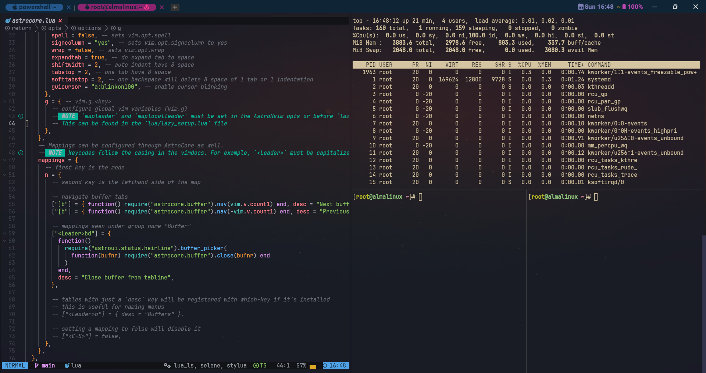
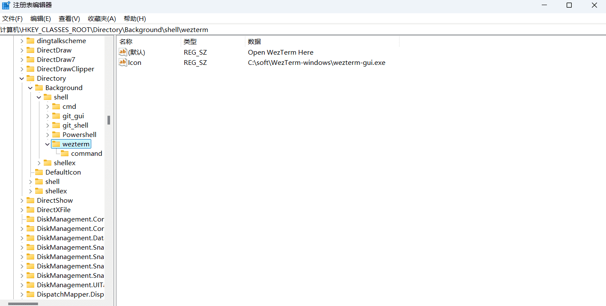
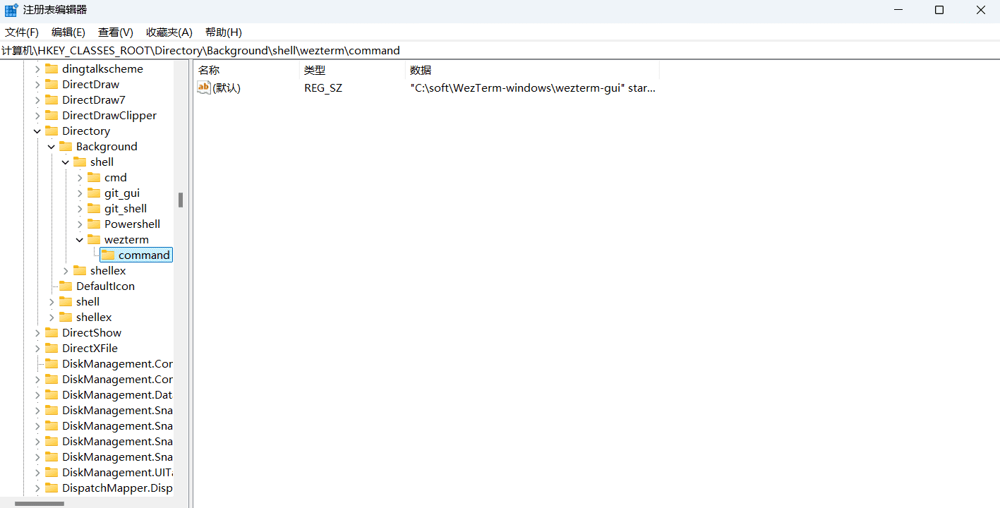

<div align="center" id="madewithlua">
  
</div>

<h1 align="center">WezTerm</h1>

<div align="center">
  <a href="https://github.com/QianSong1/wezterm-config/releases"></a>
  <a href="https://github.com/QianSong1/wezterm-config/stargazers"></a>
  <a href="https://github.com/QianSong1/wezterm-config/issues"></a>
  <br />
  <a href="https://github.com/QianSong1/wezterm-config/blob/main/LICENSE"></a>
  <a href="https://github.com/QianSong1/wezterm-config"></a>
</div>

<p align="center" style="font-weight: bold;">
A GPU-accelerated cross-platform terminal emulator and multiplexer written by <a href="https://github.com/wez">@wez</a> and implemented in <a href="https://www.rust-lang.org">Rust</a>
</p>
<p align="center">
User facing docs and guide at: <a style="font-weight: bold;" href="https://wezterm.org">wezterm.org</a>
</p>


# 我的WezTerm配置

**截图一**

 

**截图二**

 


## 原作者仓库

- <https://github.com/KevinSilvester/wezterm-config>


## 使用方法

### 1. 安装 `wezterm` 终端

[WezTerm 终端](https://github.com/wezterm/wezterm/releases)

**Windows:**
安装目录：`C:\soft\WezTerm-windows` (可根据实际情况调整)

**Linux:**
可通过包管理器安装，例如：
```bash
# Ubuntu/Debian
sudo apt install wezterm

# Arch Linux
sudo pacman -S wezterm
```

### 2. 环境配置
#### Windows

1. 下载本储存库压缩包
2. 解压压缩包
3. 将解压的文件放入：`%USERPROFILE%\.config\wezterm` 目录底下
   - 例如：`C:\Users\YourUsername\.config\wezterm`

#### Linux

1. 克隆本仓库到本地：
   ```bash
   git clone <repository-url> ~/.config/wezterm
   ```
   或者
   1. 下载本储存库压缩包
   2. 解压压缩包
   3. 将解压的文件放入：`$HOME/.config/wezterm` 目录底下


### 3. 安装字体 (Install Fonts)

此配置需要以下两种字体：
1.  **JetBrainsMono Nerd Font Mono** (用于代码和图标)
2.  **Noto Sans CJK SC** (用于中文字符显示)

所有必需的字体文件都已包含在仓库的release中。请根据您的操作系统，按照以下步骤手动安装它们。

#### Windows:
1. 打开 `fonts` 目录。
2. 选中所有 `.ttf` 或 `.ttc` 字体文件。
3. 右键单击所选文件，然后选择 “安装” 或 “为所有用户安装”。
   或者，将字体文件复制到 `C:\Windows\Fonts` 目录。

#### Linux:
1. 打开终端。
2. 将 `fonts` 目录下的所有字体文件复制到用户字体目录或系统字体目录：
   ```bash
   # 假设您已将此仓库克隆到 ~/.config/wezterm
   sudo mkdir -p /usr/local/share/fonts
   sudo cp ~/.config/wezterm/fonts/*.ttf /usr/local/share/fonts/
   sudo cp ~/.config/wezterm/fonts/*.ttc /usr/local/share/fonts/

   # 更新字体缓存
   fc-cache -fv
   ```

#### macOS:
1. 打开 `fonts` 目录。
2. 双击每个字体文件，然后在打开的“字体册”应用中点击“安装字体”按钮。


## 快捷键

```bash
#快捷键
F3              --打开启动器
F4              --显示标签页导航器
F11             --全屏
F12             --显示调试覆盖层
Ctrl+shift+c    --复制
Ctrl+shift+v    --粘贴
Ctrl+shift+t    --新建标签页
Ctrl+w          --关闭当前标签页
Alt+h           --激活左侧标签页
Alt+l           --激活右侧标签页
Alt+1~9         --激活指定序号的标签页
Ctrl+[/]        --垂直拆分窗格（上下）
Ctrl+\          --水平拆分窗格（左右）
Ctrl+[-]        --关闭当前窗格
Ctrl+UpArrow    --放大字体
Ctrl+DownArrow  --缩小字体
Ctrl+0          --重置字体大小
```


## 配置右键菜单

win+r 输入 regedit 打开注册表编辑器，依次展开`HKEY_CLASSES_ROOT`

- 底下的 `HKEY_CLASSES_ROOT\Directory` 
- 底下的 `HKEY_CLASSES_ROOT\Directory\Background` 
- 底下的  `HKEY_CLASSES_ROOT\Directory\Background\shell` 
- 新建一个项 `wezterm` ，在 `wezterm` 编辑 `Icon` 数据指向wezterm安装程序图标，编辑 `（默认）` 数据为菜单名称如 `Open Wezterm Here`，

  

然后右键新建一个项`command`，编辑 `（默认）` 数据：`"C:\soft\WezTerm-windows\wezterm-gui" start --no-auto-connect --cwd "%V\\"`

  


**完成~~~ 享受**🎉🎉🎉

